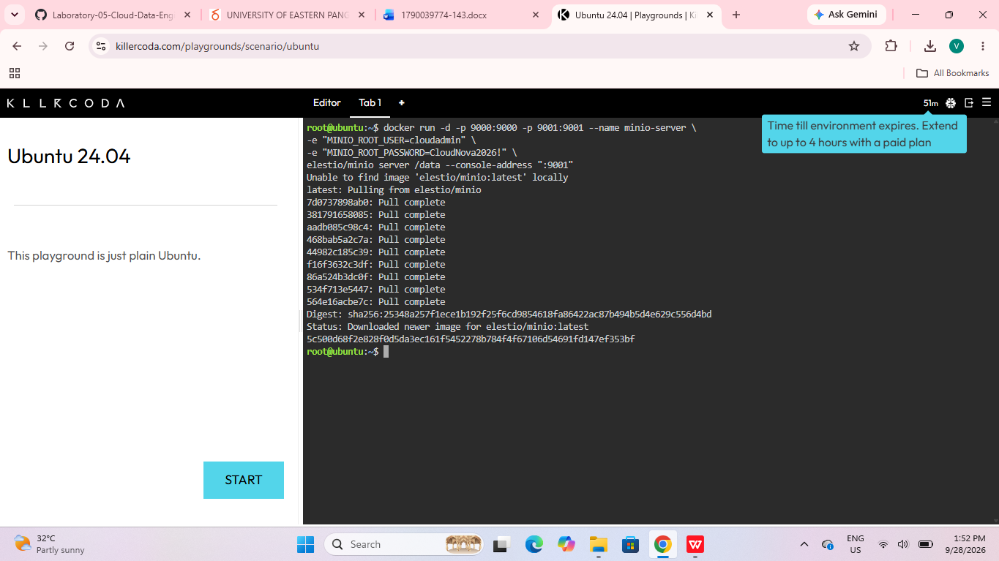
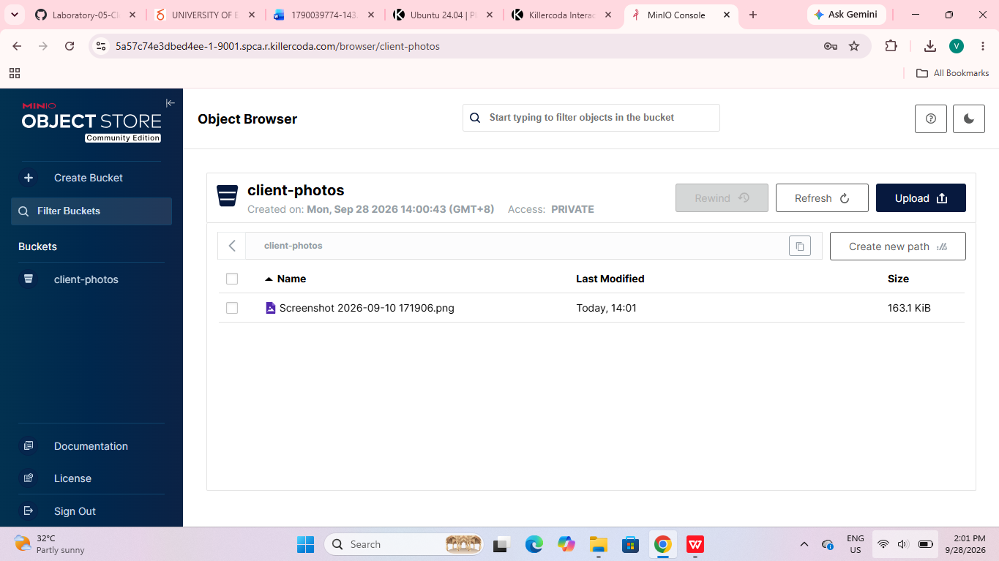

# MinIO Deployment Documentation

## 1. Environment
- Platform: KillerCoda Ubuntu Playground
- Tool: Docker
- Image: `elestio/minio`

## 2. Docker Command Used
```bash
docker run -d -p 9000:9000 -p 9001:9001 --name minio-server \
-e "MINIO_ROOT_USER=cloudadmin" \
-e "MINIO_ROOT_PASSWORD=CloudNova2026!" \
elestio/minio server /data --console-address ":9001"
```

Verification:
```bash
docker ps
```

## 3. Access Details
- **Web console port:** `9001` (opened through the KillerCoda "Traffic / Ports" tab)
- **API port:** `9000`
- **Login:** `cloudadmin` (the username set in the Docker command)

## 4. Bucket Created
- **Bucket name:** `client-photos`
- Uploaded a sample file through the **Upload** button in the console.

## 5. Explanation of the `-e` Flags
The `-e` flag sets **environment variables** inside the container when it starts.
- `MINIO_ROOT_USER=cloudadmin` sets the administrator username used to log in.
- `MINIO_ROOT_PASSWORD=CloudNova2026!` sets the administrator password.

Without these, MinIO would fall back to default credentials, which is insecure. Passing them at startup lets the same image be configured differently without modifying it.

## 6. Other Command Options
- `-d` runs the container in the background (detached).
- `-p 9000:9000 -p 9001:9001` maps the container's API and console ports to the host.
- `--name minio-server` gives the container a readable name.
- `server /data` starts MinIO and stores data in `/data`.
- `--console-address ":9001"` sets the web console to port 9001.

## 7. Evidence



